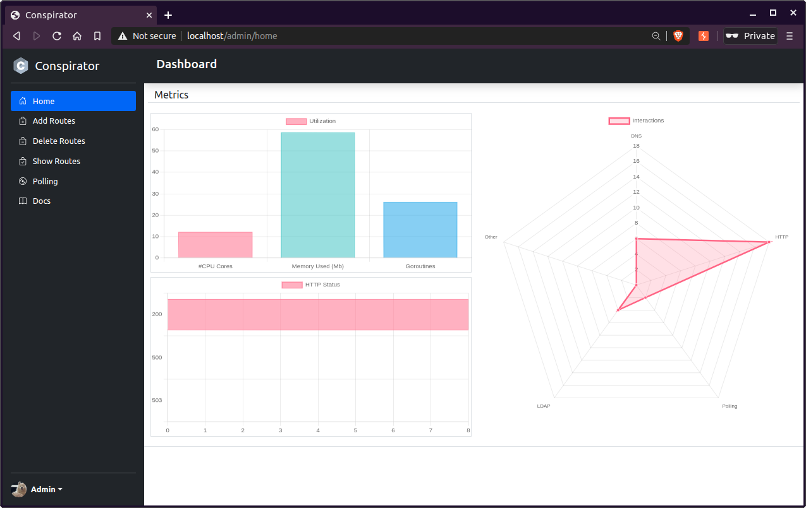
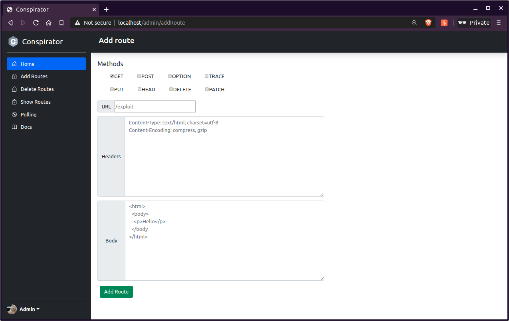

# Conspirator

**Currently, this is a personal (WIP) side-project that I work on in my spare time. I'm not taking PRs or contributions at this time.**

An extensible collaborator-like standalone server. 

## Features
* [Friendly webUI](#admin)
* [Easily add custom routes](#routes)
* [Poll interactions from UI or Burp](#polling)
* [Extendable](#extending)
* [Handles multiple zones](#dns)

## Getting Started

Download a release, or compile from src using `make bundle`. This will bundle the configuration, templates, and executable into a tarball ready for upload to a server.

| Command | Info |
| ---- | ---- |
| `./conspirator help` | Shows the help menu |
| `./conspirator config` | Generates an example configuration |
| `./conspirator start` | Starts the server |

| Start Flags | Info |
| ----------- | ---- |
| `./conspirator start -c <path>` | Starts conspirator using config provided |
| `./conspirator start -p` | Enable profiler on `localhost:6060` |

## Admin

Conspirator has a built-in `/admin` endpoint that allows the server owner to add and remove custom routes,
 poll for interaction events, view documentation, and query internal metrics right from the browser. In addition to the `/admin` endpoint, the server owner can use the bearer token available in the UI to make authenticated requests to the `/api/v1` endpoint.

API endpoint docs are provided by Swagger and available in the UI.
## Routes

Conspirator includes API endpoints that allow the server owner to add, remove, and update custom routes. Each custom route is fully configurable with `urlPath`, `methods`, `headers`, and the response `body`. Adding routes will overwrite existing routes at the same path. Removing a route will revert the endpoint to serve a random interaction event string to the client. 

Custom routes are always shown under the `showRoutes` endpoint.

## Polling
The polling server records all interactions that were captured by the server in an event queue. Records can be retrieved from the server by issuing a simple `GET` request to the polling subdomain (`pollingSubdomain`), using a websocket (such as the UI), or through Burp/Taborator's polling UI. The polling interface is restricted to IPs present in the allowlist as the polling interface does not require authentication unless using a proxy like Collaborator++. Any IP that tries to contact the polling server will get a default interaction response instead. 

Interaction events can be formatted according to the `pollingEncoding` parameter in the configuration. 
- `burp` will format as JSON encoding with fields that BurpSuite uses

By default, events in the queue do not expire by a TTL like in collaborator; instead, the queue has a finite size where old events are evicted if they have not been retrieved. This allows a user to fine-tune 
the number of events stored in memory at any given time using `maxPollingEvents` parameter. 

#### Configuring BurpSuite Pro
Conspirator can be used as a drop-in replacement for Burp's Collaborator Server by configuring your project options -> Misc -> Burp Collaborator Server with the following settings:

| Setting | Value |
| ------- | ----- |
| Use private Collaborator Server | true |
| Server Location | `your_fqdn_here` |
| Polling Location | polling.`your_fqdn_here` |
| Poll over unencrypted HTTP | false |

**Note**: Some health checks may fail or throw warnings while others succeed. These checks are not essential to using Conspirator with Burp.
## Extending

Conspirator supports extending the server using Go plugins. Plugins are compiled into shared library files, passed in the configuration, and loaded at runtime. 

To build a plugin, it is essential to implemenent the following exported methods:
- `NewServer(wrapper.Config) wrapper.Module`
- `Start()`
- `Stop()`

In addition to the exported methods, the method receiver should contain a reference to `PollingManager *polling.PollingServer`, which allows the plugin to write events to the polling server.

**Note:** As of v1.8, Go plugin only works on Linux.

## DNS

Conspirator acts as an authoritative NS for each zone specified in the configuration. The DNS server will respond to most questions including:
- A
- AAAA
- CNAME
- TXT
- MX
- IXFR (only for recording interactions)
- SRV

#### DNS Configuration
Troubleshooting, DNS over TLS, Route53 and other related docs can be found in the `docs/` folder at the root of the repository.

## TODO
- Implement SMTP
- Implement NS record
- Add GHA 
- Implement API endpoint for DNS upserts + manage zone from UI
- Refactor `show routes` UI page